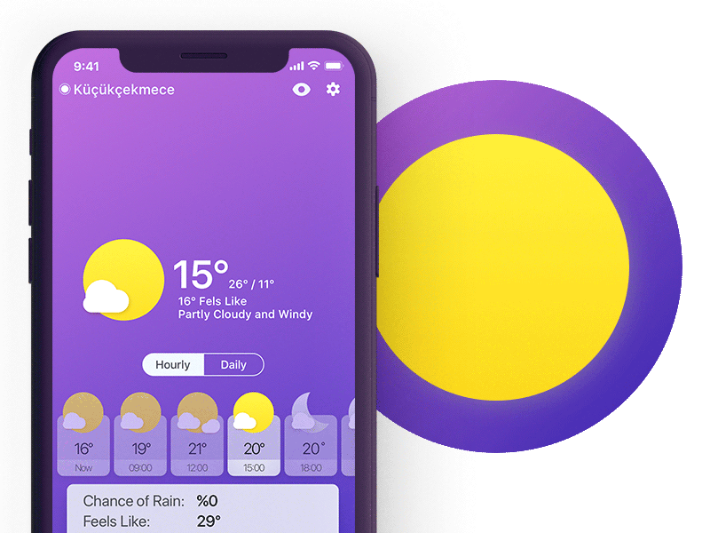

# Weather App :partly_sunny:

#  

###### * (Unstable state: Under Development) *

### Project setup:

* Create a virtual environment $ python3 -m venv /path/to/new/virtual/env.
* Install packages using $pip install <package> command.
* Save all the packages in the file with $pip freeze > requirements.txt. ...
* Pin all the package versions. ...
* Add requirements.txt to the root directory of the project.

